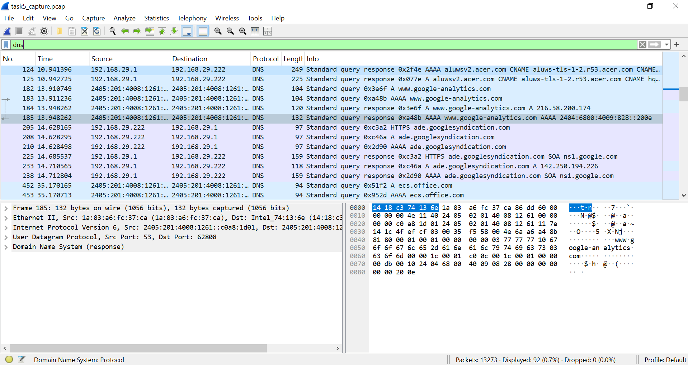
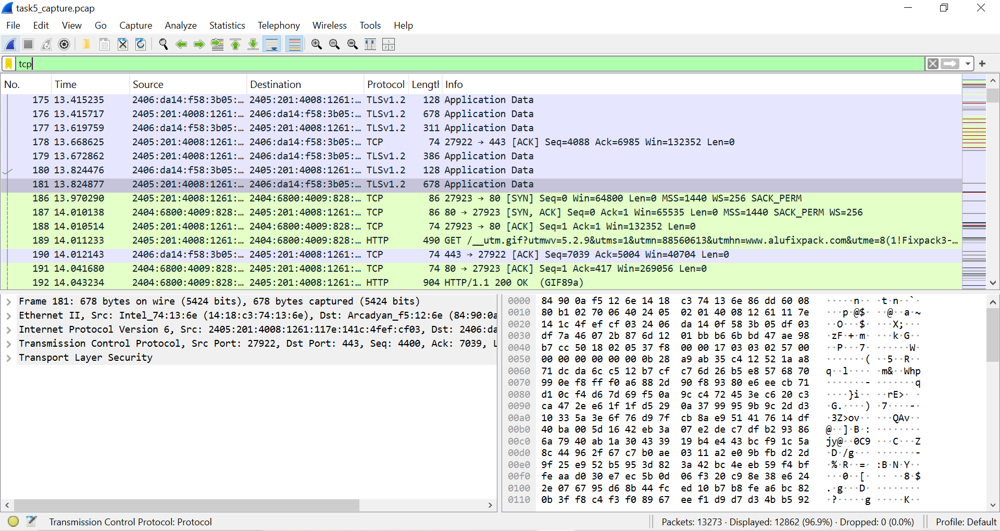
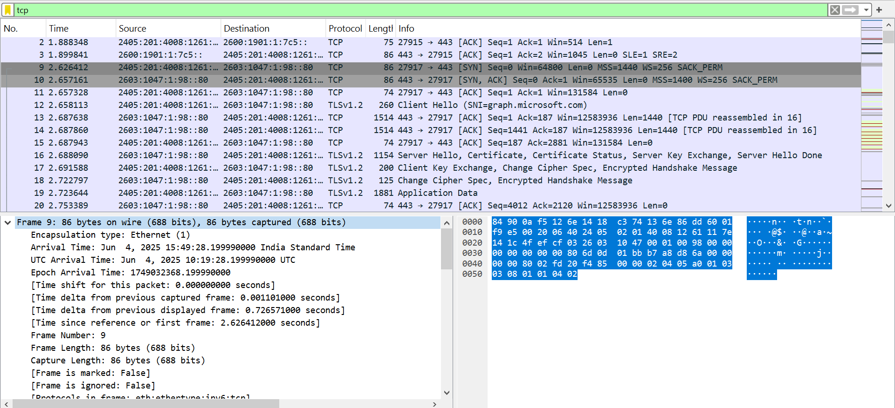
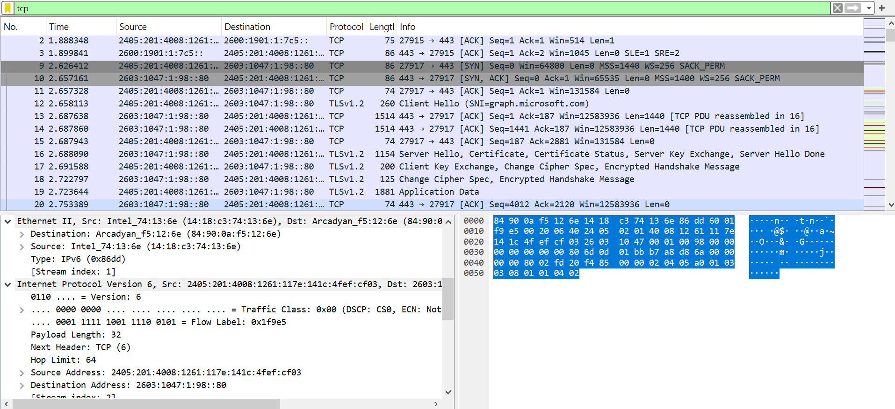
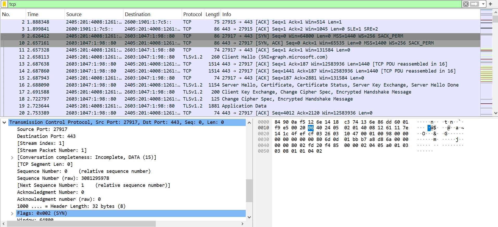

# cybersec-task-5

# Task 5 – Capture and Analyze Network Traffic Using Wireshark

## Tools Used:
- Wireshark

## Objective:
To capture live network packets and identify at least 3 different protocols.

## Steps Performed:
1. Started packet capture on active network interface.
2. Visited websites and pinged a server to generate traffic.
3. Applied filters: `dns`, `tcp`, and `http` to identify protocols.
4. Exported the captured packets into `.pcap` format.

## Protocols Identified:
- **DNS**: Queries to resolve domain names (e.g., `google.com`)
- **TCP**: Used to establish connections for web communication
- **HTTP/TLS**: Seen while accessing websites

## Sample Packet Info:
- **DNS Query**: A request to resolve `google.com`
- **TCP 3-Way Handshake**: SYN → SYN-ACK → ACK
- **HTTP GET**: Request for web content (if HTTP was seen)

## Learnings:
- Understood basic packet structures.
- Identified and filtered common network protocols.
- Gained hands-on experience using Wireshark.

## File
- `task5_capture.pcap`: The exported Wireshark capture file.

## Screenshots

### DNS Filter Applied
  
Displays DNS queries and responses captured during the scan.

### TCP Filter Applied
  
Shows TCP connection setup and TLS traffic over TCP protocol.

### TCP Packet Details (SYN)
  
Breakdown of TCP SYN packet fields such as flags, ports, and sequence numbers.

### Ethernet + IP Layers
  
Demonstrates Ethernet and IPv6 layer information in a selected TCP packet.

### Frame Metadata
  
Highlights arrival time, length, and protocol details for the selected frame.

